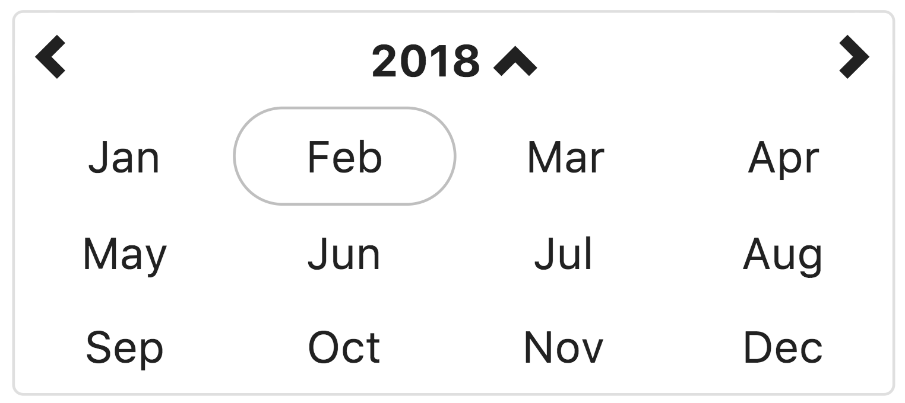
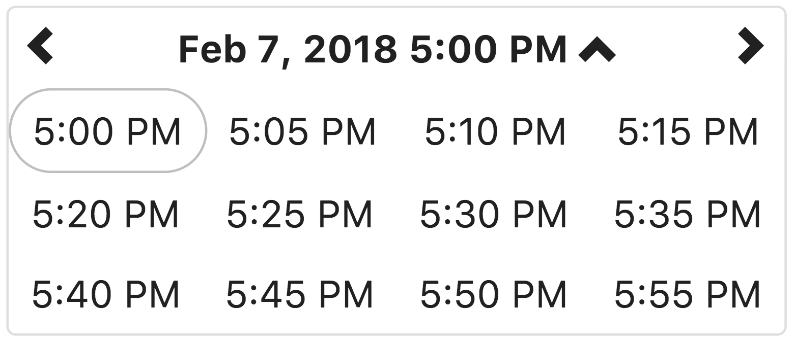

# Selector de fecha y hora con bootstrap para Angular 8+

Componente selector de fecha/hora nativo para Angular (8+) estilizado con Bootstrap 4.

[](https://www.npmjs.com/package/angular-bootstrap-datetimepicker)
[](https://travis-ci.org/dalelotts/angular-bootstrap-datetimepicker)
[](https://coveralls.io/github/dalelotts/angular-bootstrap-datetimepicker?branch=master)
[](https://david-dm.org/dalelotts/angular-bootstrap-datetimepicker)
[](https://david-dm.org/dalelotts/angular-bootstrap-datetimepicker#info=devDependencies)
[](https://snyk.io/test/npm/angular-bootstrap-datetimepicker)

[](https://gitter.im/dalelotts/angular-bootstrap-datetimepicker?utm_source=badge&utm_medium=badge&utm_campaign=pr-badge&utm_content=badge)
[![MIT License][license-image]][license-url]
[](http://commitizen.github.io/cz-cli/)
[](https://github.com/semantic-release/semantic-release)

[Documentación](http://dalelotts.github.io/angular-bootstrap-datetimepicker/) (Inglés)

[Página de demo](https://stackblitz.com/github/dalelotts/angular-bootstrap-datetimepicker-demo)

[Github](https://github.com/dalelotts/angular-bootstrap-datetimepicker)

*Leer la documentación en otro idioma: [Inglés](https://github.com/dalelotts/angular-bootstrap-datetimepicker/blob/master/README.md)*

## Angular 7.x?

Use install version 3.1.0

`npm install angularjs-bootstrap-datetimepicker@3.1.0`

## Angular 1.x?

Visita [angularjs-bootstrap-datetimepicker](https://github.com/dalelotts/angularjs-bootstrap-datetimepicker)

## Apoya el proyecto
Sé que este es un pequeño componente sin embargo mucha gente lo utiliza en producción (estoy completamente agradecido con ello) - si llegas a utilizar este componente por favor dale click al botón de estrella (en la parte superior derecha de la página).


## Versiones de Dependencias Mínimas

Versiones de dependencias mínimas:
 * AngularJS 8.x ó mayor (1.x no funcionará)
 * moment.js 2.x ó mayor para parseo de fecha y formateo
 * bootstrap 4.x para css/layout
 * open-iconic para los íconos predeterminados (puedes usar cualquier librería de íconos de tu preferencia)
 
jQuery NO es necesario.

## Uso con Angular CLI
Si estas usando [Angular CLI](https://cli.angular.io/) hay unos pequeños y simples pasos para agregar este componente a tu proyecto.

Primero, instala este módulo y las dependencias mínimas

```shell
npm install --save angular-bootstrap-datetimepicker bootstrap moment open-iconic
```

Después actualiza `./src/app/app.module.ts` para que incluya lo siguiente:

```TypeScript
import { AppComponent } from './app.component';
import { BrowserModule } from '@angular/platform-browser';
import { FormsModule } from '@angular/forms';
import { NgModule } from '@angular/core';
import { DlDateTimePickerDateModule } from 'angular-bootstrap-datetimepicker';

@NgModule({
  declarations: [
    AppComponent
  ],
  imports: [
    BrowserModule,
    FormsModule,
    DlDateTimePickerDateModule,
  ],
  providers: [FormsModule],
  bootstrap: [AppComponent]
})
export class AppModule { }
```

Posterior, agrega lo siguiente a  `./src/app/app.component.html`

```html
<dl-date-time-picker
	startView="day"
	maxView="year"
	minView="minute"
	minuteStep="5"
	[(ngModel)]="selectedDate"
>
</dl-date-time-picker>
```

A continuación, agrega lo siguiente a `./src/styles.css`

```css
@import '~bootstrap/dist/css/bootstrap.min.css';
@import '~open-iconic/font/css/open-iconic-bootstrap.css';
```

**Nota:** Este componente utiliza íconos de la libreria `open-iconic` de manera predeterminada, pero puedes utilizar cualquier librería de íconos que soporten estilizado por medio de `clases`.

Por último, ejecuta `npm start` y deberás ver el selector de fecha/tiempo en  [http://localhost:4200/](http://localhost:4200/)

De manera predeterminada, el selector de fecha/tiempo es tan ancho como su contenedor `{ width:100% }`. 
Utiliza las clases `row` y `col` de bootstrap flex para el acomodo del componente en filas y columnas.
Si el contenedor padre no es lo suficientemente ancho (mayor a 340px) el diseño de la fila y columna que contiene el componente puede que no se muestre de manera atractiva.
Otros lenguajes/locales es probable que requieran un contenedor un poco mas ancho para poder mostrar apropiadamente el contenido.

## Configuración
Utiliza el [generador de configuración automatizado](https://stackblitz.com/github/dalelotts/angular-bootstrap-datetimepicker-demo)  (¡por favor hazme saber si no funciona para tu caso!), 
o ve a [https://dalelotts.github.io/angular-bootstrap-datetimepicker/](https://dalelotts.github.io/angular-bootstrap-datetimepicker/)
para visualizar la documentación generada por automático.

### Primer día de la semana
El primer día de la semana es determinado por los [ajustes de moment i18n ](https://momentjs.com/docs/#/i18n/).
Por ejemplo, configurando el lugar a `'fr'` hará que día Lunes sea el primer día de la semana.

### Formato para visualización de año, mes, dia, hora, am/pm y minutos
El formato para horas y minutos es determinado por los [ajustes de moment i18n](https://momentjs.com/docs/#/i18n/).

Las horas son desplegadas utilizando `ll` como formato.
Los minutos son desplegados utilizando `lll` como formato. 

Recomiendo que utilices los ajustes predeterminados del lugar con Moment (si con incorrectos puedes enviar un PR  a momento para corregir los ajustes)
Si por alguna razón los ajustes predeterminados de Moment no funcionan, puedes [configurar el lugar existente](https://momentjs.com/docs/#/customization/) ó [crear un lugar personalizado](https://momentjs.com/docs/#/i18n/adding-locale/) con los formatos deseados.


## Documentación
Puedes generar la documentación ejecutando `npm run documentation`
ó ver [https://dalelotts.github.io/angular-bootstrap-datetimepicker/](https://dalelotts.github.io/angular-bootstrap-datetimepicker/)

## Accesibilidad

El componente `DlDateTimePickerComponent` agrega el atributo `aria-label` a la izquierda, derecha y botones 'arriba' adicional a todas las celdas del calendario donde el texto de la celda no pueda describir completamente el valor.

### Accesibilidad por medio del teclado 

El componente `DlDateTimePickerComponent` soporta los siguiente atajos de teclado en todas las vistas:

| Atajo            | Acción                                          |
|----------------------|-------------------------------------------------|
| `FLECHA_IZQ`         | Ir a la celda de la izquierda                      |
| `FLECHA_DER`        | Ir a la celda de la derecha                     |
| `FLECHA_ARRIBA`           | Ir a la celda superior                           |
| `FLECHA_ABAJO`         | Ir a la celda inferior                            |
| `INICIO`               | Ir a la primera celda de la vista                |
| `FIN`                | Ir a la última celda de la vista                |
| `PAGINA_ARRIBA`            | Ir a la misma celda en el periodo anterior de tiempo |
| `PAGINA_ABAJO`          | Ir a la misma celda en el periodo siguiente de tiempo     |
| `ENTRAR` o `ESPACIO`   | Seleccionar la celda actual                             |

## Capturas de pantalla

### Vista de año


Esta vista permite al usuario seleccionar el año de la fecha a elegir.
Si la vista de año es la minView, la fecha se configurará a medianoche del primer día del año.

### Vista de mes



Esta vista permite al usuario seleccionar el mes del año seleccionado.
Si el mes es minView, la fecha se configurará a medianoche del primer día del mes.

### Vista de día (Predeterminado)


Esta vista permite al usuario seleccionar el día del mes seleccionado.
Si el día es minView, la fecha se configurará a medianoche del día seleccionado.

### Vista de hora


Esta vista permite al usuario seleccionar la hora del día del día seleccionado.
Si la hora es igual a minView, la fecha se configurará al inicio de la hora del día seleccionado.

### Visa de minuto


Esta vista permite al usuario seleccionar una hora específica del dia en la hora seleccionada.
De manera predeterminada el tiempo es visualizado en incrementos de 5 minutos, la propiedad  <code>minuteStep</code> controla los incrementos del tiempo visualizado.
Si la vista de minutos es la minView, la cual es de manera predefinida, la fecha se configurará al inicio de la hora del día seleccionado.
 

## Contribuir

Ver [Contributing.md](.github/contributing.md)

### Pruebas
Este componente fué realizado utilizando TDD y todas las mejoras y cambios tiene tests.

Utilizamos karma y jshint para así garantizar la calidad del código. La manera mas sencilla de correr estas pruebas es usando gulp de la siguiente manera:

```shell
npm install
npm test
```
Karma tratará de abrir Chrome como navegador con el cual se correrán los tests.
Asegúrate de que chrome esté instalado o cambia la configuración de navegador en karma.config.js

## Licencia

angular-bootstrap-datetimepicker fué liberada con la licencia MIT y copyright 2015 Knight Rider Consulting, Inc.. Lo que anterior implica lo podrás encontrar a continuación.

## Se te pide que:

* Mantengas la licencia y el aviso de copyright incluidos en los archivos CSS y Javascript de angular-bootstrap-datetimepicker cuanto utilices esta librería en tus proyectos.

## Te permite:

* De manera libre descargar y usar angular-bootstrap-datetimepicker de manera completa o sus componentes para propósito personal, privado, de manera interna en una compañía o con fines comerciales.
* Usar angular-bootstrap-datetimepicker en paquetes o distribuciones creados por ti.
* Modificar el código fuente.
* Acceder a una sublicencia para modificar y distribuir angular-bootstrap-datetimepicker a terceros no incluidos en la licencia.

## Te prohibe:

* Responsabilizar a los autores y propietarios de las licencias por daños ya que se proporciona sin garantía angular-bootstrap-datetimepicker.
* Responsabilizar a los creadores o titulares de derechos de autor de angular-bootstrap-datetimepicker.
* Redistribuir algún componente de angular-bootstrap-datetimepicker sin la atribución adecuada.
* Utilizar alguna marca o logo propiedad de Knight Rider Consulting, Inc. de alguna manera en la que se puede entender que  Knight Rider Consulting, Inc. respalda tu distribución.
* Utilizar alguna marca o logo propiedad de Knight Rider Consulting, Inc. de alguna manera en la que se pueda entender o deducir que tu creaste este software.

## No requiere el que tu:

* Incluyas el código fuente angular-bootstrap-datetimepicker o el de alguna modificación que tú le hayas hecho al código original, o en cualquier redistribución.
* Envíes los cambios que hiciste a angular-bootstrap-datetimepicker al proyecto  angular-bootstrap-datetimepicker (sin embargo, sugerencias o cambios son bienvenidos).

La licencia completa de angular-bootstrap-datetimepicker se encuentra [en el repositorio del proyecto](LICENSE) para más información.

[license-image]: http://img.shields.io/badge/license-MIT-blue.svg?style=flat
[license-url]: LICENSE
