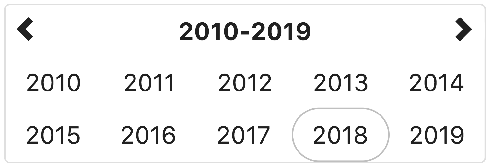
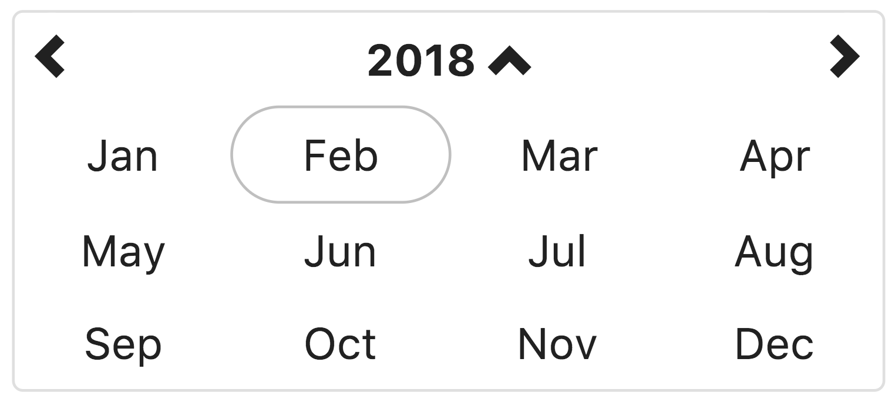
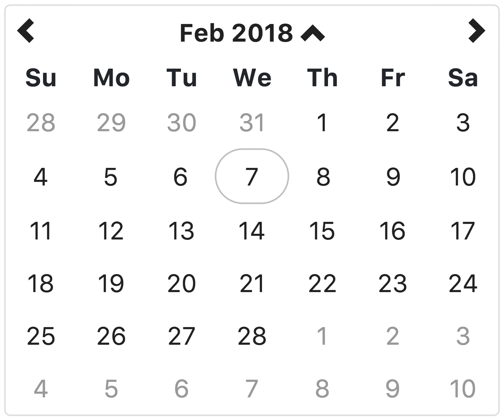
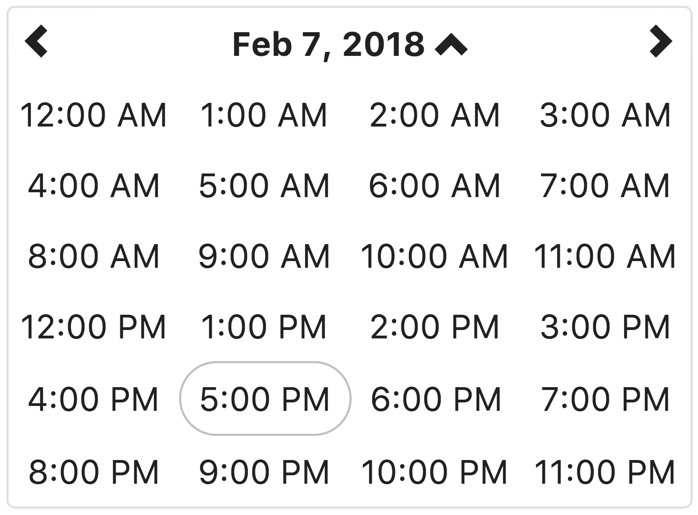
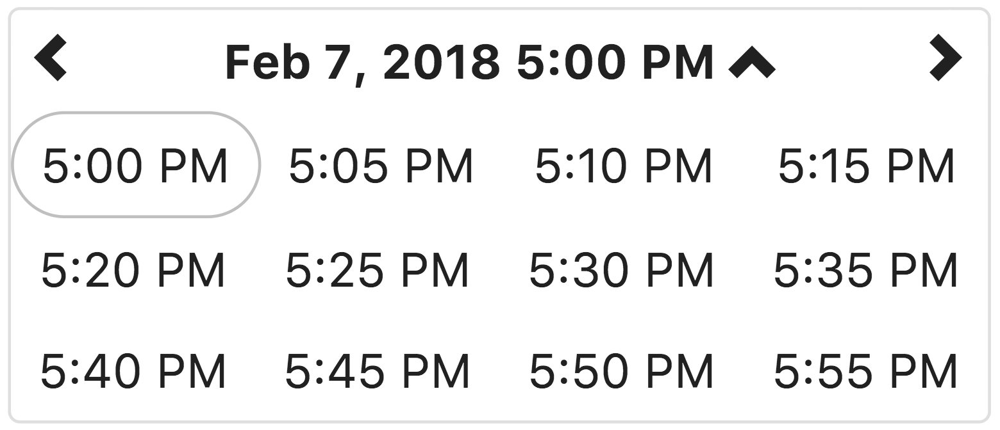

# Angular 5+ bootstrap date & time picker

Native Angular (5+) datetime picker component styled by Twitter Bootstrap 4.

[](https://www.npmjs.com/package/angular-bootstrap-datetimepicker)
[](https://travis-ci.org/dalelotts/angular-bootstrap-datetimepicker)
[](https://coveralls.io/github/dalelotts/angular-bootstrap-datetimepicker?branch=master)
[](https://david-dm.org/dalelotts/angular-bootstrap-datetimepicker)
[](https://david-dm.org/dalelotts/angular-bootstrap-datetimepicker#info=devDependencies)
[](https://snyk.io/test/npm/angular-bootstrap-datetimepicker)

[](https://gitter.im/dalelotts/angular-bootstrap-datetimepicker?utm_source=badge&utm_medium=badge&utm_campaign=pr-badge&utm_content=badge)
[![MIT License][license-image]][license-url]
[](http://commitizen.github.io/cz-cli/)
[](https://github.com/semantic-release/semantic-release)

[Home / demo page](http://dalelotts.github.io/angular-bootstrap-datetimepicker/)

## On Angular 1.x?

See [angularjs-bootstrap-datetimepicker](https://github.com/dalelotts/angularjs-bootstrap-datetimepicker)

## Support the project
I know this is a tiny component but many people use it in production (high 5 to all of us) - if you happen to use this component please click the star button (at the top of the page) - it means a lot to all the contributors.

## Peer Dependencies

Peer dependencies:
 * AngularJS 5.x or higher (1.x will not work)
 * moment.js 2.8.3 or higher for date parsing and formatting
 * bootstrap 4.x for css/layout
 * open-iconic for the default icon's (you can use any icon libary you like)
 
jQuery is NOT required.

## Usage with Angular CLI
If you are using the [Angular CLI](https://cli.angular.io/) there are a few simple steps to 
add this component to your project.

First, install this module and it's peer dependencies.

```shell
npm install --save angular-bootstrap-datetimepicker bootstrap moment open-iconic
```

Then update `./src/app/app.module.ts` to include the following:

```TypeScript
import { AppComponent } from './app.component';
import { BrowserModule } from '@angular/platform-browser';
import { FormsModule } from '@angular/forms';
import { NgModule } from '@angular/core';
import { DlDateTimePickerDateModule } from 'angular-bootstrap-datetimepicker';

@NgModule({
  declarations: [
    AppComponent
  ],
  imports: [
    BrowserModule,
    FormsModule,
    DlDateTimePickerDateModule,
  ],
  providers: [FormsModule],
  bootstrap: [AppComponent]
})
export class AppModule { }
```

Next, add the following to `./src/app/app.component.html`

```html
<dl-date-time-picker></dl-date-time-picker>
```

Next, add the following to `./src/styles.css`

```css
@import '~bootstrap/dist/css/bootstrap.min.css';
@import '~open-iconic/font/css/open-iconic-bootstrap.css';
```

**Note:** This component uses `open-iconic` icons by default, but you can use any icon library 
that supports styling with `classes`.

Finally, run `npm start` and you should see the date/time picker on [http://localhost:4200/](http://localhost:4200/)

By default, the date/time picker is as wide as it's container `{ width:100% }`. 
It uses bootstrap's flex `row` and `col` classes to layout the date/time picker into rows and columns.
If the parent container is too narrow (less than 340px in english), the row and column layout may wrap in ways that are not attractive. 
Other languages/locals may require a wider container to fit the contents.

## Configuration

Use the automated configuration generator (NOT AVAILABLE YET!) (please let me know if it does not work for your use case!), 
or see [https://dalelotts.github.io/angular-bootstrap-datetimepicker/](https://dalelotts.github.io/angular-bootstrap-datetimepicker/)
for the automatically generated documentation.

### First day of week

The first day of the week is determined by  [moment's i18n settings](https://momentjs.com/docs/#/i18n/).
For example, setting the locale to `'fr'` will cause Monday to be the first day of the week.  

### Display of year, month, day, hour, am/pm, and minute formats

The format of hours and minutes is also determined by [moment's i18n settings](https://momentjs.com/docs/#/i18n/).

hours are displayed using `ll` as the format.
minutes are displayed using `lll` as the format. 

I recommend you use the default locale settings from Moment (if they are incorrect, submit a PR to moment to correct the settings)
If for some reason the default Moment settings will not work, you can [customize the existing locale](https://momentjs.com/docs/#/customization/) or [create a custom locale](https://momentjs.com/docs/#/i18n/adding-locale/) with the desired formats.


## Documentation

You can generate the documentation by running `npm run documentation`
or see [https://dalelotts.github.io/angular-bootstrap-datetimepicker/](https://dalelotts.github.io/angular-bootstrap-datetimepicker/)

## Accessibility

The `DlDateTimePickerComponent` component adds `aria-label` attributes to the left, right, and up buttons
in addition to all calendar cells where the text of the cell may not fully describe the value.

### Keyboard Accessibility 

The `DlDateTimePickerComponent` component supports the following keyboard shortcuts in all views:

| Shortcut             | Action                                          |
|----------------------|-------------------------------------------------|
| `LEFT_ARROW`         | Go to the cell to the left                      |
| `RIGHT_ARROW`        | Go to the cell to the right                     |
| `UP_ARROW`           | Go to the cell above                            |
| `DOWN_ARROW`         | Go to the cell below                            |
| `HOME`               | Go to the first cell in the view                |
| `END`                | Go to the last cell in the view                 |
| `PAGE_UP`            | Go to the same cell in the previous time period |
| `PAGE_DOWN`          | Go to the same cell in the next time period     |
| `ENTER` or `SPACE`   | Select current cell                             |

## Screen shots

### Year view



This view allows the user to select the year for the target date.
If the year view is the minView, the date will be set to midnight on the first day of the year

### Month view



This view allows the user to select the month in the selected year.
If the month view is the minView, the date will be set to midnight on the first day of the month.

### Day view (Default)



This view allows the user to select the the day of the month, in the selected month.
If the day view is the minView, the date will be set to midnight on the day selected.

### Hour view



This view allows the user to select the hour of the day, on the selected day.
If the hour view is the minView, the date will be set to the beginning of the hour on the day selected.

### Minute view



This view allows the user to select a specific time of day, in the selected hour.
By default, the time is displayed in 5 minute increments. The <code>minuteStep</code> property controls the increments of time displayed.
If the minute view is the minView, which is is by default, the date will be set to the beginning of the hour on the day selected.
 

## Contributing

See [Contributing.md](.github/contributing.md)

### Testing
This component was written using TDD and all enhancements and changes have related tests.

We use karma and jshint to ensure the quality of the code. The easiest way to run these checks is to use gulp:

```shell
npm install
npm test
```

The karma task will try to open Chrome as a browser in which to run the tests.
Make sure Chrome is available or change the browsers setting in karma.config.js

## License

angular-bootstrap-datetimepicker is released under the MIT license and is copyright 2015 Knight Rider Consulting, Inc.. Boiled down to smaller chunks, it can be described with the following conditions.

## It requires you to:

* Keep the license and copyright notice included in angular-bootstrap-datetimepicker's CSS and JavaScript files when you use them in your works

## It permits you to:

* Freely download and use angular-bootstrap-datetimepicker, in whole or in part, for personal, private, company internal, or commercial purposes
* Use angular-bootstrap-datetimepicker in packages or distributions that you create
* Modify the source code
* Grant a sublicense to modify and distribute angular-bootstrap-datetimepicker to third parties not included in the license

## It forbids you to:

* Hold the authors and license owners liable for damages as angular-bootstrap-datetimepicker is provided without warranty
* Hold the creators or copyright holders of angular-bootstrap-datetimepicker liable
* Redistribute any piece of angular-bootstrap-datetimepicker without proper attribution
* Use any marks owned by Knight Rider Consulting, Inc. in any way that might state or imply that Knight Rider Consulting, Inc. endorses your distribution
* Use any marks owned by Knight Rider Consulting, Inc. in any way that might state or imply that you created the Knight Rider Consulting, Inc. software in question

## It does not require you to:

* Include the source of angular-bootstrap-datetimepicker itself, or of any modifications you may have made to it, in any redistribution you may assemble that includes it
* Submit changes that you make to angular-bootstrap-datetimepicker back to the angular-bootstrap-datetimepicker project (though such feedback is encouraged)

The full angular-bootstrap-datetimepicker license is located [in the project repository](LICENSE) for more information.


## Donating
Support this project and other work by Dale Lotts via [gittip][gittip-dalelotts].

[![Support via Gittip][gittip-badge]][gittip-dalelotts]

[gittip-badge]: https://rawgithub.com/twolfson/gittip-badge/master/dist/gittip.png
[gittip-dalelotts]: https://www.gittip.com/dalelotts/

[license-image]: http://img.shields.io/badge/license-MIT-blue.svg?style=flat
[license-url]: LICENSE
